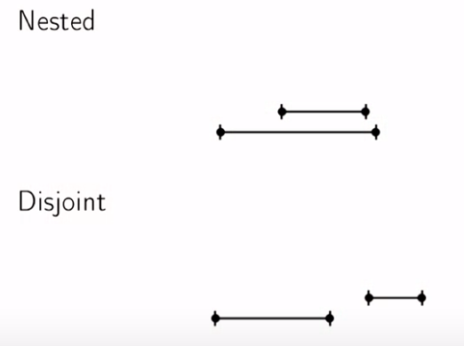

## Exploring graphs

### Paths

A **path in a graph** G is a sequence of the vertices v0, v1, ...  that for all i, (v<i>, v<i + 1>) is an edge of the G.

#### Rechability

**INPUT :** Graph G and vertex s

**OUTPUT :** The collection of the vertices v of the G so that there is a path from s to v.

Find which vertix in G are rechable from others.

##### Components(s)

```

Components(s) {

	DiscoveredNodes = [s]

	while there is an edge e leaving DiscoveredNodes that has not been explored: // Explore(v)
		add vertex at the other end of the e to DiscoveredNodes

	return DiscoveredNodes

}

```

To keep track of the vertices found:
- Give each vertix boolean variable visited(v).

- Keep a list of the vertices with edges left to check.
- This will end up getting hidden in the program stack.

We will explore new edges in depth first order.

- **Explore function** find all the vertices which can be reached by the given ndoe.

#### Explore(v)

```

Explore(v) {

	visited(v) = true

	previsit(v)

	for (v, w) in E:  // E is the list of the edges.
		if not visited(w):
			Explore(w)

	postvisit(v)

}

```

For explore to work we need adjancency list representation.


If we want to explore all the vertices in the graph we use **depth first search**

#### DFS(G)

```

DFS(G) {

	for all v in V:
		mark v unvisited

	for v in V:
		if not visited(v):
			Exlpore(v)

}

```

*Previsit* and *Postvisit* numbers tell us about the execusion of the DFS.

For any vertices u, v the intervals [pre(u), post(u)] and [pre(v), post(v)] are either nested or disjoint.




Assume that u visited before v. Then there are two possible cases:

* We find v while exploring u (u become ansestor of v) (post(u) > post(v))
* We find v after exploring u (u become cousin of v) (post(u) < pre(v))

##### Runtime

	DFS(G): O(|V| + |E|) // Linear Time Search


### Connectivity

##### Theorm

The vertices of a graph G can be partitioned into **connected components** so thet v is rechable from w if and onoy if they are in same connected component.

### Connected Components

**Input:** Graph G

**Output:**  The connected conponents of G.

#### Explore(v)

```

Explore(v) {

	visited(v) = true

	CCnum(v) = cc // Lable each connected component differently.

	previsit(v)

	for (v,w) in E:
		if not visited(w):
			Explore(w)

	postvisit(v)

}

```

#### DFS(G)

```

DFS(G) {

	for all v in V:
		mark v unvisited

	cc = 1

	for v in V:
		if not visited(v):
			Explore(v)
			cc = cc + 1

}

```

##### Runtime

	DFS(G): O(|V| + |E|) // Linear Time Search

#### Preorder(v)

```

Preorder(v) {
	pre(v) = pr

	pr = pr +1

}

```

#### Postorder(v)

```

Postorder(v) {
	pre(v) = po

	po = po +1

}

```