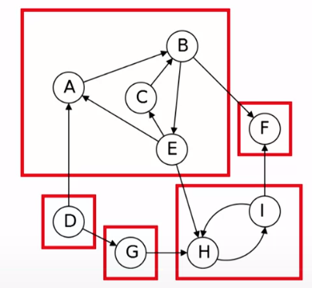
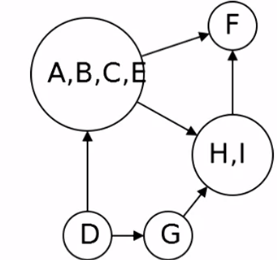
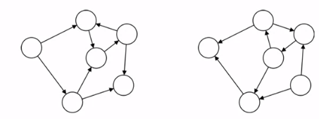

## Connectivity in graph

#### Defination

Two vertices v, w in a directed graph are **connected** if you can reach v from w and can reach w from v.

##### Theorm

A directed graph can be partitioned into **strongly connected components** where two vertices are connected if and only if they are in same component.



From each of the square we can reach any vertex which is in same square. So each of the square is a independent connected components.

##### Theorm

A directed graph can be partationed into **strongly connected components** where two vertices are connected if and only if they are in the same components.

#### Metagraph



- The metagraph of the any graph G is a DAG.

### Strongly Connected Component

**Input :** A directed graph G.

**Output :** The strongly connected component

#### EasySCC(G)

```

EasyScc(G) {

	for each vertex v:
		run explore to determine vertices rechable from v

	for each vertex v:
		find the u rechable from v that can also reach v

	these are the SCCs

}

```

**Runtime:** O($|V|^2$ + |V||E|)

We need faster algorithm from this one.

- The vertex with the largest postorder number is in a sourec component.

### Reverse Graph

A graph obtain by reversing all the edges in a given graph G is called **Reverse Graph** ($G^R$).



- Both of the graph has the same strongly connected components.
- Sourece component of the $G^R$ are sink component of G.

We can find the sink components of the G by running DFS on $G^R$.

The vertex with the largest postorder in $G^R$ is in sink SCC of G.

#### SSCs(G)

```

SCCs(G) {

	run DFS($G^R$)
	let c be the largest post number
	run explore(v)
	vertices found are first SCC
	Remove from the G and repreat.

}

```

This algorithm is also little bit un-efficient as we need to run the DFS on each component.

###### Improvement

- We don't need to rerun DFS on $G^R$.
- Largest remaining post number comes from sink conponent.

#### SCCs_effective(G)

```

SCCs_effective(G) {

	Run DFS($G^R$)

	for v in V in reverse postorder:
		if not visited(v):
			Explore(v)
			mark visited vertices as new SCC.

}

```

**Runtime:** O(|V| + |E|)