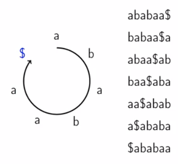
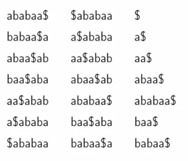
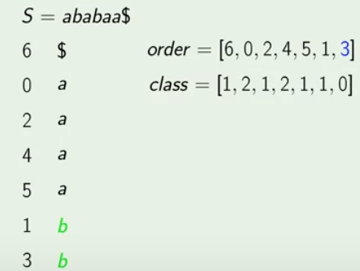
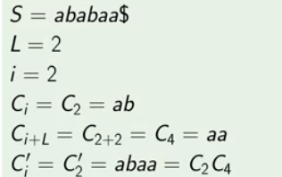
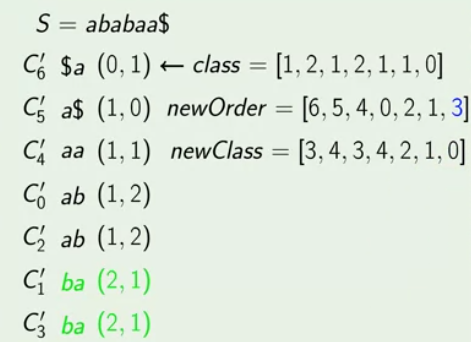

### Sorting Cyclic Shift

Arrange the elements of string in cyclic order and then start from any element and then go around the string.

###### Examples

Given below is the cyclic shift of the string **ababaa$**.



After the sorting of the given cyclic shift and then removing the element after $ symbol will give us the required suffixes.



#### Partial Cyclic Shift

Substring of cyclic string S are called partial cyclic shifts of S.

###### Example

Given below the cyclic shift of length 4 of given string "ababaa$"


### General Strategy for construction

- Start with the sorting single chracters of S.
- Cyclic shift of length L = 1 soretd.
- While l < |S|, sort shift of length 2L
- If L >= |S|, cyclic shifts of length L sort the same way as cyclic shifts of length |S|.

### Initialiation

#### SortChracters(S)

- **Input:** String
- **Output:** The order of the string as output.

```

SortChracters(S) {

	order = array of size |S|
	count  = zero array of size |ALphabet|

	for i from 0 to |S| - 1:
		count[S[i]] = count[S[i]] + 1

	for j from 1 to |Alphabet| - 1:
		count[j] = count[j] + count[j - 1]

	for i from |S| - 1 down to 0:
		c = S[i]
		count = count[c] - 1
		order[count[c]] = i

	return order

}

```

**Running Time:** O(|S|+|Alphabet|)


#### Equivalence Classes

- C{i} - Partial cyclic shift of length L starting in i
- C{i} can be equal to C{j} - then they are in one equivalance class
- Compute class[i] - number of different cyclic shifts of length L that are strictly smaller then C{i}
- C{i} == C{j} <=> class[i] == class[j]
- length of class is equal to length of the string.

###### Example



##### Steps

1. Sort the string and Find the order of the given string.
2. Now from first letter of the sorted string find the order of the string and if string is diffeternt then the previous string then class[order[string]] = previous class
3. Othervise it is same.


##### ComputeCharClasses(S, order)

**Input:**  given string and the order of the string and give the class of the string.

```

ComputeCharClasses(S, order) {

	class = array of size |S|
	class[order[0]] = 0

	for i from 1 to |S| - 1:
		if S[order[i]] != S[order[i - 1]]:
			class[order[i]] = class[order[i]] + 1

		else
			class[order[i]] = class[order[i]]

	return class

}

```

**Running Time:** O(|S|)

#### Double Cyclic Shift

##### Idea

- C{i} - Cyclic shift of length L stating in i
- C{i}' - Double cyclic shift starting in i
- C{i}' = C{i} + C{i + l} - Concatenation of the string
- To compare C{i}' with C{j}', it's sufficient to compare C{i} with C{j} and C{i + L} with C{j + L}

###### Example



##### Sorting Pairs

- First sort by the second element of pair
- Then stable sort by the first element of the pair.

##### Idea

- C{i}' - double cyclic shift starting in i
- C{i}' is a pair of (C{i}, C{i + L})
- C{order[0]}, C{order[1]}, .... , C{order[|S| - 1]} are already sorted
- Take the double cyclic shift starting exactily L counter-clockwise ("to the left")
- C{order[0] - L}, C{order[1] - L}, .... , C{order[|S| - 1] - L} are sorted by second element of pair
- C{order[0] - L}', C{order[1] - L}', .... , C{order[|S| - 1] - L}' are sorted by second element of pair
- Do a stable sort {counting sort} by first element of the pairs
- We know equivalenve classes of single shift of counting sort.

##### SortDouble(S, L, order, class)

>Sort the doubed cyclic shift of length L.

```

SortDouble(S, L, order, class) {

	count = zero array of size |S|
	newOrder = array of size |S|

	for i from 0 to |S| - 1:
		count[class[i]] = count[class[i]] + 1

	for j from 1 to |S| - 1:
		count[j] = count[j] + count[j - 1]

	for i from |S| - 1 down to 0:
		start = (ordre[i] - L + |S|) mod |S|
		cl = class[start]
		count[cl] = count[cl] - 1
		newOrder[count[cl]] = start

	return newOrder

}

```

**Running Time:** O(|S|)

##### Updating the classes of Double cyclic shift

- Since the pair are sorted, go through the pairs in order, if any pair ois different from prevoius, put it into a new class, otherwise put it into previouss class
- (P{1}, P{2}) == (Q{1}, Q{2}) <=> (P{1} == Q{1}) and (P{2} == Q{2})
- We know equivalence classes of equal elements of pairs.

###### Example



##### UpdateClass(newOrder, class, L)

```

UpdateClass(newOrder, class, L) {

	n = |newOrder|
	newClass = array of size n

	newClass[newOrder[0]] = 0

	for i from 1 to n - 1:
		cur = newOrder[i]
		prev = newOrder[i - 1]

		mid = (cur + L) (mod n)
		midPrev = (prev + L) (mod n)

		if class[cur] != class[prev] or class[mid] != class[midPrev]:
			newClass[cur] = newClass[prev] + 1

		else:
			newClass[cur] = newClass[prev]

	return newClass

}

```

**Running Time:** O(|S|)

#### BuildSuffixArray(S)

```

BuildSuffixArray(S) {

	order = SortChracters(S)
	class = ComputeCharClasses(S, order)

	L = 1

	while L < |S|:

		order = SortDoubled(S, L, order, class)
		class = UpdateClasses(order, class, L)

		L = 2L

	return order

}

```

**Running Time:** O(|S|.log(|S|) + |Alphabet| )